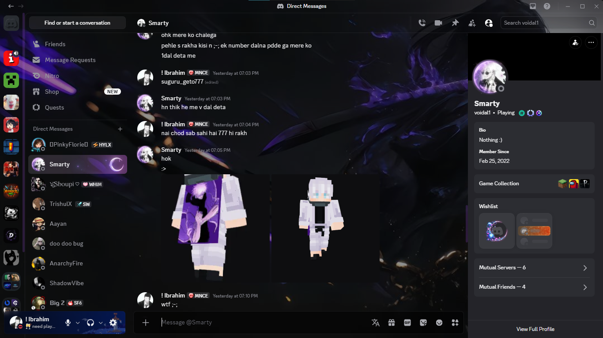

# 🌌 Aesthetic Dark - Discord Glassmorphism Theme

A premium, highly-optimized dark aesthetic theme for Discord. Built with a focus on deep contrasts, frosted glass (glassmorphism) UI elements, and a serene, dangerous Japanese-inspired visual identity. 

## ✨ Features
* **Frosted Glass UI:** True backdrop blurs on sidebars, chat windows, and user popouts.
* **Minimalist Scrollbars:** WebKit scrollbars stripped down and replaced with sleek, animated indicators.
* **Interactive Elements:** Folders and text inputs feature custom shadow states, glowing borders, and smooth transition animations.
* **Zero Clutter:** Single-column server layouts and disabled native animations for a distraction-free environment.
* **Built on NAAT:** Utilizes the robust NotAnotherAnimeTheme core for absolute structural stability.

## 🚀 Installation

### For Vencord Users (Easiest)
1. Open Discord Settings -> **Vencord** -> **Themes**.
2. Click on **Online Themes**.
3. Paste the following raw link into the input box and hit Enter: `https://raw.githubusercontent.com/Zenin-tojii/discord-aesthetic-dark-theme/main/astheticdark.theme.css`
4. The theme will apply instantly and automatically update whenever a new version is pushed.

### For BetterDiscord Users
1. Download the `astheticdark.theme.css` file from this repository.
2. Open Discord Settings -> **BetterDiscord** -> **Themes**.
3. Click **Open Theme Folder** and drop the downloaded file inside.
4. Toggle the theme **ON** in the Discord settings.

---
*Created by [Ibrahim](https://github.com/Zenin-tojii).*# discord-aesthetic-dark-theme
